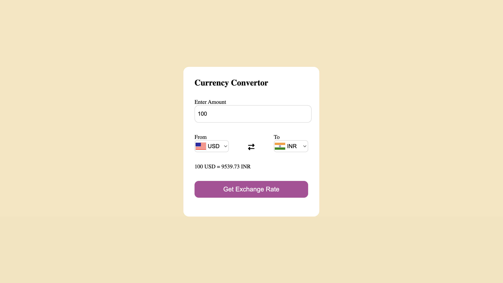

<div align="center">

# 💱 Currency Converter

### A modern and responsive Currency Converter built using HTML, CSS & JavaScript

Convert currencies instantly using live exchange rates through a public Currency API.


</div>

---

# 🌐 Live Demo

👉 https://manikgupta-2004.github.io/currency-converter/

---

# 📸 Project Preview

<p align="center">

</p>

---

# 📖 About The Project

This project is a fully responsive Currency Converter that allows users to convert one currency into another using real-time exchange rates from a public API.

The application provides an intuitive user interface, country flags, dynamic currency selection, and accurate conversion results, making it an excellent frontend project for practicing API integration and asynchronous JavaScript.

---

# ✨ Features

- 🌍 Real-time Currency Conversion
- 💱 150+ Supported Currencies
- 🚩 Country Flags
- 📱 Fully Responsive Design
- ⚡ Fast API Integration
- 🎨 Clean Modern UI
- 🔄 Swap Currencies
- 📊 Accurate Exchange Rates

---

# 🛠 Tech Stack

- HTML5
- CSS3
- JavaScript (ES6)
- Fetch API
- Currency Exchange API

---

# 📂 Project Structure

```
currency-converter/
│
├── index.html
├── style.css
├── script.js
├── codes.js
├── screenshot.png
└── README.md
```

---

# 🚀 Getting Started

Clone the repository

```
git clone https://github.com/manikgupta-2004/currency-converter.git
```

Open

```
index.html
```

in your browser.

---

# 📚 What I Learned

- Working with REST APIs
- Fetch API
- Async / Await
- Promises
- JSON Handling
- Dynamic DOM Manipulation
- Responsive UI Design
- Error Handling

---

# 🎯 Future Improvements

- Historical Exchange Rates
- Currency Charts
- Dark Mode
- Favorite Currency List
- Offline Support

---

# 👨‍💻 Author

**Manik Gupta**

Frontend Developer | JavaScript Enthusiast

GitHub:
https://github.com/manikgupta-2004

---

<div align="center">

⭐ If you like this project, don't forget to Star this repository!

</div>
